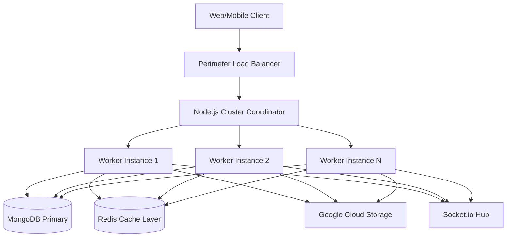
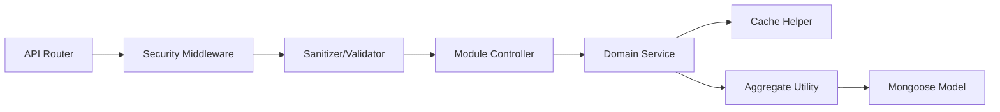
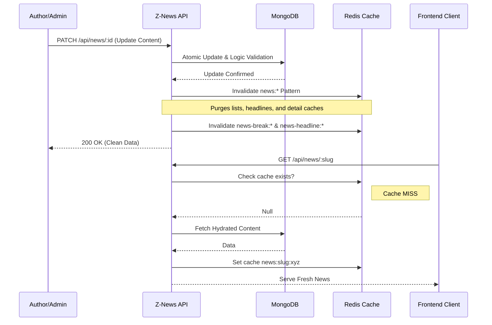

# Z-News Server

This high-performance, enterprise-grade news portal backend architecture orchestrates dynamic news delivery, hierarchical category management, real-time engagement monitoring, and automated notification systems. Engineered for high-concurrency and data integrity, it serves as the robust backbone for the Z-News ecosystem.

---

## Table of Contents

- [Z-News Server](#z-news-server)
  - [Table of Contents](#table-of-contents)
  - [Core Modules and Features](#core-modules-and-features)
    - [Authentication and Security](#authentication-and-security)
    - [News \& Editorial Management](#news--editorial-management)
    - [User Engagement \& Gamification](#user-engagement--gamification)
    - [Community \& Infrastructure](#community--infrastructure)
  - [Tech Stack](#tech-stack)
  - [Security and Data Protection](#security-and-data-protection)
  - [Architecture](#architecture)
    - [System Architecture Diagram](#system-architecture-diagram)
    - [Internal Dependency Flow](#internal-dependency-flow)
  - [Cross-Module Relational Logic](#cross-module-relational-logic)
  - [Project Directory Map](#project-directory-map)
  - [Database Schema](#database-schema)
    - [Detailed Entity-Relationship Diagram](#detailed-entity-relationship-diagram)
  - [Detailed API Endpoints](#detailed-api-endpoints)
  - [Endpoint Operation Patterns](#endpoint-operation-patterns)
  - [Workflow Diagrams](#workflow-diagrams)
    - [News Mutability \& Cache Sync Workflow](#news-mutability--cache-sync-workflow)
  - [Development and Deployment](#development-and-deployment)
    - [Development Setup](#development-setup)
    - [Production Strategy](#production-strategy)
  - [Production Readiness Checklist](#production-readiness-checklist)
  - [License](#license)

---

## Core Modules and Features

### Authentication and Security

- **Hybrid RBAC Architecture**: Granular Role-Based Access Control supporting `super-admin`, `admin`, `editor`, `author`, `contributor`, `subscriber`, and `user`.
- **Ecosystem Security**: Comprehensive protection via Helmet.js, global and route-specific rate limiting, MongoDB injection sanitization, and strict CORS policies.
- **JWT Lifecycle**: Advanced token management featuring secure rotation, password change tracking, and account verification states.

### News & Editorial Management

- **Segmented Article Flow**: Specialized handling for `Breaking News`, `Headlines`, and `Featured` articles with independent lifecycle controls.
- **Hierarchical Category Engine**: Advanced recursive tree architecture supporting infinite category nesting and aggregation.
- **Automatic Version Control**: Comprehensive `ArticleVersion` snapshots triggered automatically on content mutation, enabling audit trails and restoration.

### User Engagement & Gamification

- **Reputation & Achievement Engine**: Advanced `Badge` system integrated with `UserProfile` stats, automatically awarding experience points and reputation points.
- **Activity & Streak Tracking**: Calendar-based `Reading Streak` logic and granular interaction counters (`articles_read`, `total_comments`, `total_reactions`).
- **Interactive Community**: Feature-rich `Poll` system with real-time results, anonymous voting options, and nesting comment threads.
- **Personalized Collections**: Multi-list `Bookmark` management system for curating private reading lists.

### Community & Infrastructure

- **Enhanced Engagement**: Sophisticated `Comment` threading (up to 5 levels), user mentions, moderation flagging, and focused `Reaction` metrics.
- **Intelligent Caching**: Redis-powered caching layer with pattern-based invalidation and query-stable key generation.
- **Cloud Storage Orchestration**: Robust Google Cloud Storage integration with automated file lifecycle management.
- **Communication Engine**: Multi-channel `Notification` delivery (Web, Socket) with priority tiers and recipient tracking.

---

## Tech Stack

| Category                | Technology                                       |
| :---------------------- | :----------------------------------------------- |
| Runtime Environment     | Node.js (v18+)                                   |
| Core Framework          | Express.js (v5.x - Next Gen Architecture)        |
| Programming Language    | TypeScript (v5.x)                                |
| Persistent Storage      | MongoDB with Mongoose (v8.x)                     |
| Distributed Caching     | Redis (ioredis) for Lookups and Socket.io        |
| Object Storage          | Google Cloud Storage (GCS)                       |
| Real-time Engine        | Socket.io with Redis Adapter                     |
| Runtime Validation      | Zod (End-to-end type safety)                     |
| Security Infrastructure | bcrypt, jsonwebtoken, helmet, express-rate-limit |

---

## Security and Data Protection

The system implements an industry-standard security posture to protect sensitive editorial workflows and user data.

### Defensive Security Layers

- **Advanced Request Sanitization**:
  - Integrated `mongo-sanitize` at the middleware level to recursively scrub `$` and `.` characters from `req.body`, `req.query`, and `req.params`.
  - Effectively neutralizing NoSQL Injection attempts before they reach the service layer.
- **Intelligent Traffic Governance (Rate Limiting)**:
  - **Global Limiter**: Restricts baseline traffic to prevent broad DDoS spikes.
  - **Auth Limiter**: Implements strict thresholds on `/api/auth` endpoints to thwart brute-force password guessing and credential stuffing attacks.
  - **Dynamic Window**: Uses a 15-minute sliding window with customizable error messages and automated IP blocking.
- **Enterprise-Grade Response Hardening (Helmet.js)**:
  - Automatically configures 15+ secure HTTP headers including:
    - **Content-Security-Policy (CSP)**: Mitigates XSS by restricting source origins.
    - **Strict-Transport-Security (HSTS)**: Enforces SSL/TLS connections.
    - **X-Frame-Options**: Prevents Clickjacking by disallowing unauthorized framing.
- **Strict Production CORS**:
  - Whitelist-based origin verification ensures only authorized frontend environments (e.g., `admin.z-news.com`) can communicate with the API.

### Authentication & Authorization

- **JWT Perimeter**: Stateless authentication using industry-standard JSON Web Tokens with `HS256` signing and automated expiration handling.
- **Granular RBAC Architecture**:
  - A sophisticated Role-Based Access Control system enforces strict permission boundaries across roles: `super-admin`, `admin`, `editor`, `author`, `contributor`, `subscriber`, and `user`.
- **Cryptographic Hashing**: User passwords undergo `Bcrypt` salting with 12 rounds of computational work, ensuring maximum resistance against rainbow table attacks.
- **Input Integrity (Zod)**: Every API entry point is guarded by a `Zod` validator, performing rigid runtime schema enforcement and eliminating "garbage-in" data risks.

### Data Integrity & Operations

- **Soft Delete Pattern**: Implements a logical deletion strategy where data is flagged rather than purged, maintaining historical auditability and protecting against accidental loss.
- **Atomic Concurrency Control**: Engagement metrics (Likes, Views) utilize MongoDB's atomic `$inc` operators to ensure data consistency under high-volume parallel updates.

---

## Architecture

### System Architecture Diagram

<div align="center">



</div>

### Internal Dependency Flow

<div align="center">



</div>

---

## Cross-Module Relational Logic

The platform operates on a reactive architecture where events in one module trigger logical ripples across others:

### 1. The Interaction-to-Profile Loop

- **View-to-Streak**: Every unique `View` on a news article verifies the user's `last_read_at`. Using a **Calendar-based difference**, the system increments the `reading_streak` and `articles_read` count in the `UserProfile`.
- **Engagement-to-Stats**: Creating a `Comment`, `Reaction`, or `Poll Vote` automatically increments the corresponding activity counters (`total_comments`, `total_reactions`) in the user's profile.

### 2. Gamification & Reputation

- **Achievement Awards**: The `Badge` service monitors profile stats. When thresholds are met (e.g., 100 comments), a badge is awarded.
- **Points Pipeline**: Awarding a `Badge` automatically transfers its associated `points` to the `UserProfile.reputation_score`.

### 3. Editorial Data Integrity

- **Auto-Versioning**: Any mutation of critical `News` content (Title, Slug, or Body) triggers an atomic snapshot in the `ArticleVersion` module before the update commits, preserving a perfect audit trail.
- **Cascading Lifecycle**: When a `News` document is permanently deleted, the system executes a cascading cleanup of all associated `Comments`, `Reactions`, `Polls`, `Bookmarks`, and `Versions` to maintain referential integrity.

---

## Project Directory Map

```text
src/
├── app/
│   ├── builder/        # AppQueryFind and Custom AppError classes
│   ├── config/         # Centralized environment registries and GCP/Redis flags
│   ├── interfaces/     # Global type definitions and index interfaces
│   ├── middlewares/    # Auth, RBAC, Rate-Limit, Sanitize, and Log handlers
│   ├── modules/        # Domain-driven features (21 specialized modules)
│   │   ├── news/       # Core editorial logic and engagement counters
│   │   ├── user-profile/ # Gamification, reputations, and activity stats
│   │   ├── badge/      # Achievement definitions and awarding logic
│   │   ├── poll/       # Interactive voting and result aggregation
│   │   ├── bookmark/   # Reading list management
│   │   ├── article-version/ # Content snapshots and audit logs
│   │   └── ...         # Engagement, Notification, and File modules
│   ├── redis/          # Cache initialization and Pub/Sub configuration
│   ├── routes/         # Centralized API versioning and route mounting
│   ├── socket/         # Real-time relay orchestration
│   └── utils/          # Core utilities (cache.utils, catchAsync, sendResponse)
├── app.ts              # Express pipeline and global middleware configuration
└── index.ts            # Bootloader with Managed Cluster Execution
```

---

## Database Schema

### Detailed Entity-Relationship Diagram

```mermaid
erDiagram
    %% Core Identity & Community
    User ||--o{ News : "authors"
    User ||--o{ Comment : "posts"
    User ||--o{ Reaction : "reacts"
    User ||--o{ View : "performs"
    User ||--o{ Notification : "sends"
    User ||--o{ NotificationRecipient : "receives"

    %% News Ecosystem Management
    News ||--|| NewsHeadline : "promoted_as"
    News ||--|| NewsBreak : "featured_as"
    News }o--|| Category : "primary_category"
    News }o--o{ Category : "secondary_categories"
    News ||--o{ Comment : "has_comments"
    News ||--o{ Reaction : "has_reactions"
    News ||--o{ View : "has_views"
    News ||--o| Event : "contextualized_by"
    News ||--o| Storage : "cloud_thumbnail"
    News ||--o| File : "local_thumbnail"

    %% Taxonomy & Hierarchy
    Category ||--o{ Category : "parent_of"
    Category ||--o{ Event : "classifies"
    Notification ||--o{ NotificationRecipient : "delivered_to"

    %% Gamification & Engagement Extension
    User ||--|| UserProfile : "has_profile"
    UserProfile ||--o{ Badge : "earns"
    News ||--o{ ArticleVersion : "has_history"
    User ||--o{ Bookmark : "bookmarks"
    News ||--o{ Bookmark : "bookmarked_in"
    User ||--o{ Poll : "votes_on"
    News ||--o{ Poll : "contains_poll"
    Comment ||--o{ Reaction : "comment_reactions"
    Comment ||--o{ Comment : "replies_to"

    %% ============================================
    %% DETAILED MODEL ATTRIBUTES
    %% ============================================

    User {
        ObjectId _id PK
        string name "Required, 2-50 chars"
        string email "Required, Unique, Indexed"
        string password "Hashed, select: false"
        string role "super-admin|admin|editor|author|user|..."
        string status "in-progress|blocked"
        boolean is_verified
        boolean is_deleted
        string auth_source "email|google"
        timestamp created_at
    }

    News {
        ObjectId _id PK
        string title "Indexed"
        string slug "Unique, Indexed"
        string content "Rich Text/HTML"
        ObjectId category FK
        ObjectId author FK
        string status "draft|pending|published|archived"
        boolean is_featured
        date published_at
        date expired_at
        boolean is_deleted
    }

    Category {
        ObjectId _id PK
        string name "Unique"
        string slug "Unique, Indexed"
        ObjectId category FK "Self-Reference"
        number sequence "Order 1-100"
        string icon "Default: blocks"
        string status "active|inactive"
        boolean is_deleted
    }

    Comment {
        ObjectId _id PK
        ObjectId news FK
        ObjectId user FK "Optional"
        string guest "Optional UUID"
        string name "Fallback for guests"
        string email "Fallback for guests"
        string content "Max 300 chars"
        string status "pending|approved|rejected"
        boolean is_edited
    }

    Reaction {
        ObjectId _id PK
        ObjectId news FK
        ObjectId user FK
        string guest "Optional"
        string type "like|dislike"
        string status "approved"
    }

    View {
        ObjectId _id PK
        ObjectId news FK
        ObjectId user FK
        string guest "Optional"
    }

    UserProfile {
        ObjectId _id PK
        ObjectId user FK "Unique"
        number reputation_score
        number reading_streak "Calendar-based"
        number articles_read
        object[] badges "earned_at mapping"
        object notification_preferences
    }

    Badge {
        ObjectId _id PK
        string name
        string type "Interaction/Streak/Reputation"
        number points "Awarded to profile"
        object criteria "threshold logic"
    }

    ArticleVersion {
        ObjectId _id PK
        ObjectId news FK
        ObjectId editor FK
        string content_snapshot
        string change_reason
    }

    Bookmark {
        ObjectId _id PK
        ObjectId user FK
        ObjectId news FK
        ObjectId reading_list FK
    }

    Poll {
        ObjectId _id PK
        ObjectId news FK
        ObjectId created_by FK
        string title
        object[] options "vote counters & voters"
        boolean allow_anonymous
    }

    NewsHeadline {
        ObjectId _id PK
        ObjectId news FK "Uniqueness enforced"
        string status "draft|published"
        date published_at
        date expired_at
    }

    NewsBreak {
        ObjectId _id PK
        ObjectId news FK "Uniqueness enforced"
        string status "draft|published"
        date published_at
        date expired_at
    }

    Notification {
        ObjectId _id PK
        string title
        string message
        string type "news-request|comment|reaction|..."
        string priority "low|medium|high|urgent"
        string[] channels "web|push|email"
        ObjectId sender FK
    }

    NotificationRecipient {
        ObjectId _id PK
        ObjectId notification FK
        ObjectId recipient FK
        json metadata "Action URLs/Images"
        boolean is_read
        date read_at
    }

    Event {
        ObjectId _id PK
        string name
        string slug "Unique"
        ObjectId category FK
        string status "active|inactive"
        date published_at
        date expired_at
    }

    Storage {
        ObjectId _id PK
        string file_name "Cloud Identifier"
        string bucket "GCS Bucket Name"
        string url "Public CDN Link"
        string mimetype
        number size
        ObjectId author FK
        string status "active|archived"
    }

    File {
        ObjectId _id PK
        string url "Local Server Link"
        string path "Server Disk Path"
        string mimetype
        number size
    }
```

<div align="center">



</div>

The database utilizes a document-oriented schema optimized for high-performance read operations and editorial consistency. Every major entity implements a **Strict Soft-Delete Strategy** and is tightly integrated with the **Redis Caching Layer**. Relationships are maintained through **Atomic ObjectIDs**, with comprehensive indexing on `slugs`, `emails`, and `status` fields to ensure millisecond-level query execution even under heavy load.

---

## Detailed API Endpoints

The system exposes the service layer via the `/api` namespace:

- **Identity**: `/api/auth` (Login, Registration, Password Management)
- **Editorial**: `/api/news`, `/api/news-headline`, `/api/news-break`
- **Taxonomy**: `/api/category` (Includes tree and public views)
- **Engagement**: `/api/comment`, `/api/reaction`, `/api/view`
- **Gamification**: `/api/user-profile`, `/api/badge`
- **Curation**: `/api/bookmark`, `/api/poll`
- **History**: `/api/article-version`
- **Awareness**: `/api/notification`, `/api/notification-recipient`
- **Personnel**: `/api/user`, `/api/guest`
- **Cloud Assets**: `/api/storage` (Google Cloud Storage Management)
- **Local Assets**: `/api/file`, `/api/media`
- **Events**: `/api/event`

---

## Endpoint Operation Patterns

Standardization is strictly enforced across all domain modules:

- **Listings**: `GET /api/{module}` (Server-side search, multi-field filtering, pagination)
- **Detail**: `GET /api/{module}/:id` (Fully populated document hydration)
- **Creation**: `POST /api/{module}` (Zod validation and transaction safety)
- **Modification**: `PATCH /api/{module}/:id` (Strict partial update logic)
- **Soft Delete**: `DELETE /api/{module}/:id` (Historical preservation fallback)
- **Permanence**: `DELETE /api/{module}/:id/permanent` (Final byte eradication)
- **Bulk Actions**: `DELETE /api/{module}/bulk` (Batch processing)
- **Restoration**: `POST /api/{module}/:id/restore` (Lifecycle reversal)

---

## Workflow Diagrams

### News Mutability & Cache Sync Workflow

<div align="center">



</div>

---

## Development and Deployment

### Development Setup

1. **Dependency Installation**:

   ```bash
   pnpm install
   ```

2. **Configuration**:
   Populate the `.env` file using the configuration template. Ensure `REDIS_ENABLED`, `GOOGLE_CLOUD_PROJECT_ID`, and `GOOGLE_CLIENT_ID` are set for full infrastructure support.

3. **Running in Dev Mode**:
   ```bash
   pnpm run start:dev
   ```

### Production Strategy

1. **Build & Transpile**:

   ```bash
   pnpm build
   ```

2. **Managed Execution**:
   Run with the cluster engine for maximum throughput:

   ```bash
   pnpm run start
   ```

3. **Docker Orchestration**:
   ```bash
   docker-compose up -d --build
   ```

---

## Production Readiness Checklist

- [x] **Clustering**: Multi-core worker orchestration enabled.
- [x] **Caching**: Pattern-based Redis invalidation logic fully integrated.
- [x] **Storage**: Enterprise Google Cloud Storage middleware configured.
- [x] **Security**: Full Zod schema validation, RBAC enforcement, and Google OAuth integration.
- [x] **Resilience**: Graceful shutdown and Redis fallback mechanisms.

---

## License

Proprietary and Confidential. Unauthorized duplication or distribution is strictly prohibited.
