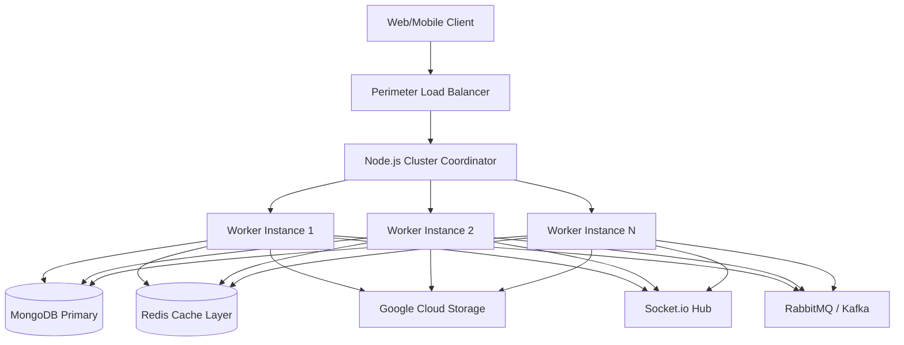
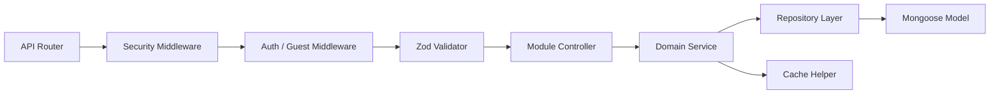
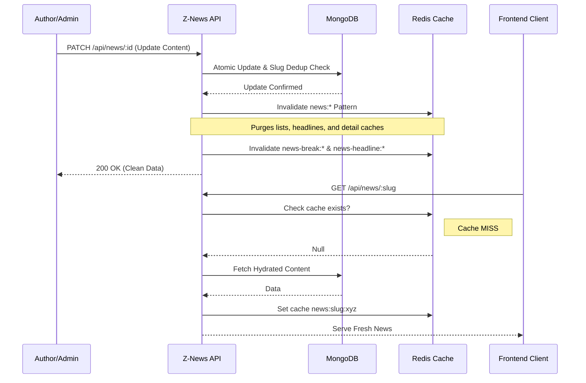
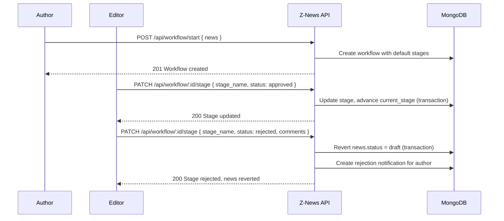

# Z-News Server

A high-performance, enterprise-grade news portal backend that orchestrates dynamic news delivery, hierarchical category management, real-time engagement, editorial workflow pipelines, and multi-channel notification systems. Engineered for high-concurrency and data integrity, it serves as the robust backbone for the Z-News ecosystem.

---

## Table of Contents

- [Z-News Server](#z-news-server)
  - [Table of Contents](#table-of-contents)
  - [Core Modules and Features](#core-modules-and-features)
    - [Authentication and Security](#authentication-and-security)
    - [News \& Editorial Management](#news--editorial-management)
    - [User Engagement \& Gamification](#user-engagement--gamification)
    - [Community \& Infrastructure](#community--infrastructure)
  - [Tech Stack](#tech-stack)
  - [Security and Data Protection](#security-and-data-protection)
  - [Architecture](#architecture)
    - [System Architecture Diagram](#system-architecture-diagram)
    - [Internal Dependency Flow](#internal-dependency-flow)
  - [Cross-Module Relational Logic](#cross-module-relational-logic)
  - [Project Directory Map](#project-directory-map)
  - [Database Schema](#database-schema)
    - [Detailed Entity-Relationship Diagram](#detailed-entity-relationship-diagram)
  - [Detailed API Endpoints](#detailed-api-endpoints)
  - [Endpoint Operation Patterns](#endpoint-operation-patterns)
  - [Workflow Diagrams](#workflow-diagrams)
    - [News Mutability \& Cache Sync Workflow](#news-mutability--cache-sync-workflow)
  - [Development and Deployment](#development-and-deployment)
    - [Development Setup](#development-setup)
    - [Production Strategy](#production-strategy)
  - [Production Readiness Checklist](#production-readiness-checklist)
  - [License](#license)

---

## Core Modules and Features

### Authentication and Security

- **Hybrid RBAC Architecture**: Granular Role-Based Access Control supporting `super-admin`, `admin`, `editor`, `author`, `contributor`, `subscriber`, `user`, and `guest`.
- **Ecosystem Security**: Comprehensive protection via Helmet.js, global and route-specific rate limiting (including per-IP brute-force protection on auth endpoints), MongoDB injection sanitization, and strict CORS policies applied before all other middleware.
- **JWT Lifecycle**: Stateless token management with secure access/refresh rotation, password change token versioning, reset token invalidation after use, and account verification states.
- **Google OAuth**: Social sign-in via `google-auth-library` with automatic profile creation.
- **Guest Sessions**: Anonymous interaction support with expiration-validated guest tokens for commenting and voting.

### News & Editorial Management

- **Segmented Article Flow**: Specialized handling for `Breaking News`, `Headlines`, and `Featured` articles with independent lifecycle controls and scheduling.
- **Hierarchical Category Engine**: Recursive tree architecture supporting infinite category nesting with `$graphLookup` aggregation.
- **Automatic Version Control**: Atomic `ArticleVersion` snapshots triggered on content mutation, enabling full audit trails and restoration.
- **Editorial Workflow Pipeline**: Multi-stage approval pipeline (`drafting → editing → fact-checking → legal-review → publishing`) with RBAC-controlled stage assignments. Rejection automatically reverts the article to `draft` and notifies the author.
- **Slug Uniqueness**: Single-query slug deduplication with regex pattern matching — resolves conflicts with counter suffixes without N+1 queries.
- **Scheduled Publishing**: Cron-based scheduler publishes and archives articles at configured times. Runs exclusively on cluster worker 0 to prevent race conditions.

### User Engagement & Gamification

- **Badge & Reputation System**: `Badge` definitions with type, criteria, and points — manually awarded by admins, reflected in `UserProfile.reputation_score`.
- **Activity Counters**: Granular interaction tracking (`articles_read`, `total_comments`, `total_reactions`) incremented atomically on each engagement event.
- **Interactive Community**: `Poll` system with duplicate-vote prevention, anonymous voting support, multi-option voting, and virtual result-percentage calculation on read.
- **Personalized Collections**: Multi-list `Bookmark` management with paginated retrieval and reading list organization.

### Community & Infrastructure

- **Comment System**: Threaded comment support with guest participation, moderation flags, and enhanced-comment endpoints for deep reply trees.
- **Reaction Metrics**: Focused `like`/`dislike` reactions on both news articles and comments.
- **Intelligent Caching**: Redis-powered caching with query-stable key generation and pattern-based invalidation.
- **Cloud Storage**: Google Cloud Storage integration for file uploads with MIME-type validation at both the middleware and service layers.
- **Multi-Channel Notifications**: `Notification` + `NotificationRecipient` architecture delivering via `web`, `push`, and `email` (nodemailer/resend), with per-user preference enforcement.
- **Message Brokers**: Optional RabbitMQ and Kafka integration for event-driven decoupling (configurable via env flags).
- **Notification Templates**: Reusable `Template` module for structured notification content.

---

## Tech Stack

| Category                | Technology                                           |
| :---------------------- | :--------------------------------------------------- |
| Runtime Environment     | Node.js (v18+)                                       |
| Core Framework          | Express.js (v5.x)                                    |
| Programming Language    | TypeScript (v5.x)                                    |
| Persistent Storage      | MongoDB with Mongoose (v8.x)                         |
| Distributed Caching     | Redis (redis v5.x) for lookups and Socket.io adapter |
| Object Storage          | Google Cloud Storage (GCS) v7.x                      |
| Real-time Engine        | Socket.io v4.x with Redis Adapter                    |
| Runtime Validation      | Zod v3.x (end-to-end type safety)                    |
| Email Delivery          | Nodemailer v7.x / Resend (configurable provider)     |
| Message Brokers         | RabbitMQ (amqplib) + Kafka (kafkajs) — optional      |
| Security Infrastructure | bcrypt, jsonwebtoken, helmet, express-rate-limit      |
| Testing                 | Jest with @swc/jest (49 suites, 408 tests)            |

---

## Security and Data Protection

The system implements an industry-standard security posture to protect sensitive editorial workflows and user data.

### Defensive Security Layers

- **Advanced Request Sanitization**:
  - Integrated `mongo-sanitize` at the middleware level to recursively scrub `$` and `.` characters from `req.body`, `req.query`, and `req.params`.
  - Effectively neutralizing NoSQL injection attempts before they reach the service layer.
- **Intelligent Traffic Governance (Rate Limiting)**:
  - **Global Limiter**: Restricts baseline traffic to prevent broad DDoS spikes.
  - **Auth Limiter**: Strict thresholds on `/api/auth` endpoints to thwart brute-force and credential stuffing attacks.
  - **Password Reset Limiter**: Dedicated per-IP rate limit on `POST /api/auth/forget-password` (5 requests / 15 min) to prevent email enumeration.
  - **Dynamic Window**: 15-minute sliding window with customizable error messages.
- **Enterprise-Grade Response Hardening (Helmet.js)**:
  - Configures 15+ secure HTTP headers including CSP, HSTS, and X-Frame-Options.
- **Strict Production CORS**:
  - Whitelist-based origin verification applied as the **first middleware** in the pipeline, ensuring preflight `OPTIONS` requests are handled before any other processing.
- **File Upload Protection**:
  - MIME type validation enforced at both the route middleware layer and the service layer, preventing content-type spoofing.
- **Path Traversal Prevention**:
  - File deletion paths validated against the configured uploads directory before any disk operation.

### Authentication & Authorization

- **JWT Perimeter**: Stateless authentication using JSON Web Tokens with access/refresh token rotation and `HS256` signing.
- **Role Enforcement Fix**: Auth middleware correctly uses `&&` logic — access is denied unless the user's role is explicitly in the allowed roles list.
- **Password Reset Security**: Reset tokens are nullified in the database immediately after successful use, preventing token reuse attacks.
- **Granular RBAC Architecture**: Strict permission boundaries across 8 roles — `super-admin`, `admin`, `editor`, `author`, `contributor`, `subscriber`, `user`, `guest`.
- **Cryptographic Hashing**: Passwords hashed with `bcrypt` (12 salt rounds).
- **Input Integrity (Zod)**: Every API entry point guarded by a Zod validator with rigid runtime schema enforcement.
- **Workflow RBAC**: Workflow stage assignees are validated for required role (`editor`, `admin`, or `super-admin`) before assignment.

### Data Integrity & Operations

- **Soft Delete Pattern**: Logical deletion flagging preserves historical auditability and protects against accidental data loss.
- **Atomic Concurrency Control**: Engagement metrics use MongoDB's atomic `$inc` operators for consistency under parallel updates.
- **Workflow Transactions**: Workflow stage approval/rejection and associated news status updates execute within a MongoDB session transaction for atomicity.
- **Guest Token Expiration**: Guest session tokens are validated for expiration on each use.

---

## Architecture

### System Architecture Diagram

<div align="center">


```mermaid
graph TB
    Client[Web/Mobile Client]
    LB[Perimeter Load Balancer]
    Cluster[Node.js Cluster Coordinator]
    W1[Worker Instance 1]
    W2[Worker Instance 2]
    WN[Worker Instance N]

    DB[(MongoDB Primary)]
    Cache[(Redis Cache Layer)]
    GCS[Google Cloud Storage]
    Socket[Socket.io Hub]
    MQ[RabbitMQ / Kafka]

    Client --> LB
    LB --> Cluster
    Cluster --> W1 & W2 & WN
    W1 & W2 & WN --> DB
    W1 & W2 & WN --> Cache
    W1 & W2 & WN --> GCS
    W1 & W2 & WN --> Socket
    W1 & W2 & WN --> MQ
```

</div>

### Internal Dependency Flow

<div align="center">


```mermaid
graph LR
    Router[API Router]
    Mid[Security Middleware]
    Auth[Auth / Guest Middleware]
    Val[Zod Validator]
    Cont[Module Controller]
    Serv[Domain Service]
    Repo[Repository Layer]
    Cache[Cache Helper]
    Mongoose[Mongoose Model]

    Router --> Mid
    Mid --> Auth
    Auth --> Val
    Val --> Cont
    Cont --> Serv
    Serv --> Cache
    Serv --> Repo
    Repo --> Mongoose
```

</div>

---

## Cross-Module Relational Logic

The platform operates on a reactive architecture where events in one module trigger logical ripples across others:

### 1. Editorial Workflow State Machine

- **Draft → Approval Pipeline**: Starting a workflow creates multi-stage checkpoints. Each stage can be `approved`, `rejected`, or `skipped`.
- **Rejection Cascade**: When a stage is `rejected`, the associated news article is automatically reverted to `draft` status and the author receives a notification.
- **Final Approval**: Approving the last stage automatically publishes the news article.

### 2. Engagement-to-Profile Loop

- **Engagement-to-Stats**: Creating a `Comment`, `Reaction`, or `Poll Vote` automatically increments the corresponding activity counters (`total_comments`, `total_reactions`) in the user's `UserProfile`.
- **Reputation Points**: Awarding a `Badge` transfers its associated `points` to `UserProfile.reputation_score`.

### 3. Editorial Data Integrity

- **Auto-Versioning**: Any mutation of critical `News` content triggers an atomic snapshot in `ArticleVersion` before the update commits, preserving a perfect audit trail.
- **Cascading Lifecycle**: Permanent deletion of a `News` document triggers cascading cleanup of associated `Comments`, `Reactions`, `Polls`, `Bookmarks`, and `Versions`.

### 4. Notification Delivery

- **Preference-Gated Delivery**: Before sending any notification, the recipient's `notification_preferences` profile is checked — disabled channels are skipped.
- **Multi-Channel Fan-out**: Notifications are delivered via Socket.io (real-time `web`) and email (nodemailer/resend) based on configured channels.

---

## Project Directory Map

```text
src/
├── builder/            # AppQueryFind, AppQueryAggregation, AppError classes
├── config/             # DB, Redis, Socket.io, Kafka, RabbitMQ initializers
├── constants/          # Shared constant definitions
├── enums/              # Shared TypeScript enums
├── errors/             # Custom error classes
├── events/             # Event emitter definitions
├── interface/          # Global type definitions
├── jobs/               # Scheduled job initializers
├── middlewares/        # Auth, RBAC, Rate-Limit, Sanitize, File, Guest, Log
├── modules/            # 23 domain-driven feature modules
│   ├── auth/           # JWT auth, Google OAuth, password reset
│   ├── user/           # User CRUD and management
│   ├── user-profile/   # Reputation, badges, activity stats, follows
│   ├── guest/          # Anonymous session management
│   ├── news/           # Core editorial logic, scheduling, slug uniqueness
│   ├── news-headline/  # Promoted headline lifecycle
│   ├── news-break/     # Breaking news lifecycle
│   ├── category/       # Hierarchical category tree
│   ├── workflow/       # Editorial approval pipeline with stage transactions
│   ├── article-version/ # Content snapshots and audit logs
│   ├── comment/        # Threaded comment system with guest support
│   ├── reaction/       # Like/dislike reactions on news and comments
│   ├── view/           # Article view tracking
│   ├── poll/           # Voting system with duplicate prevention and results
│   ├── bookmark/       # Reading list management (paginated)
│   ├── badge/          # Achievement definitions and admin awarding
│   ├── notification/   # Notification creation and admin management
│   ├── notification-recipient/ # Per-user delivery tracking and read status
│   ├── template/       # Reusable notification templates
│   ├── event/          # Event tagging for news articles
│   ├── file/           # Local file upload management
│   ├── media/          # Media metadata management
│   └── scheduler/      # Cron-based publish/archive jobs (worker 0 only)
├── policies/           # Authorization policy helpers
├── providers/          # External service provider stubs
├── routes/             # Centralized API route mounting
├── scripts/            # Utility scripts
├── services/           # Shared services (cache, email, token, notification)
├── templates/          # Email/notification HTML templates
├── types/              # Shared TypeScript types
├── utils/              # cache.utils, catchAsync, sendResponse, send-email
├── validators/         # Shared Zod validation schemas
├── __mocks__/          # Jest manual mocks (@google-cloud/storage)
├── __tests__/          # Integration test suites (4 flows, 30 scenarios)
├── app.ts              # Express pipeline and global middleware configuration
├── index.ts            # Bootloader with cluster orchestration
└── test-setup.ts       # Jest environment variable injection
```

---

## Database Schema

### Detailed Entity-Relationship Diagram

<div align="center">


```mermaid
erDiagram
    %% Core Identity & Community
    User ||--o{ News : "authors"
    User ||--o{ Comment : "posts"
    User ||--o{ Reaction : "reacts"
    User ||--o{ View : "performs"
    User ||--o{ Notification : "sends"
    User ||--o{ NotificationRecipient : "receives"

    %% News Ecosystem Management
    News ||--|| NewsHeadline : "promoted_as"
    News ||--|| NewsBreak : "featured_as"
    News }o--|| Category : "primary_category"
    News }o--o{ Category : "secondary_categories"
    News ||--o{ Comment : "has_comments"
    News ||--o{ Reaction : "has_reactions"
    News ||--o{ View : "has_views"
    News ||--o| Event : "contextualized_by"
    News ||--o| Storage : "cloud_thumbnail"
    News ||--o| File : "local_thumbnail"
    News ||--|| Workflow : "has_workflow"

    %% Taxonomy & Hierarchy
    Category ||--o{ Category : "parent_of"
    Category ||--o{ Event : "classifies"
    Notification ||--o{ NotificationRecipient : "delivered_to"

    %% Gamification & Engagement Extension
    User ||--|| UserProfile : "has_profile"
    UserProfile ||--o{ Badge : "earns"
    News ||--o{ ArticleVersion : "has_history"
    User ||--o{ Bookmark : "bookmarks"
    News ||--o{ Bookmark : "bookmarked_in"
    User ||--o{ Poll : "votes_on"
    News ||--o{ Poll : "contains_poll"
    Comment ||--o{ Reaction : "comment_reactions"
    Comment ||--o{ Comment : "replies_to"

    %% ============================================
    %% DETAILED MODEL ATTRIBUTES
    %% ============================================

    User {
        ObjectId _id PK
        string name "Required, 2-50 chars"
        string email "Required, Unique, Indexed"
        string password "Hashed, select: false"
        string role "super-admin|admin|editor|author|contributor|subscriber|user|guest"
        string status "in-progress|blocked"
        boolean is_verified
        boolean is_deleted
        string auth_source "email|google"
        timestamp created_at
    }

    News {
        ObjectId _id PK
        string title "Indexed"
        string slug "Unique, Indexed — auto-deduplicated"
        string content "Rich Text/HTML"
        string content_type "article|video|podcast|gallery|liveblog"
        ObjectId category FK
        ObjectId author FK
        string status "draft|pending|scheduled|published|archived"
        string sensitivity_level "public|sensitive|restricted"
        string canonical_url "Optional, validated URL"
        boolean is_featured
        date published_at
        date expired_at
        boolean is_deleted
    }

    Category {
        ObjectId _id PK
        string name "Unique"
        string slug "Unique, Indexed"
        ObjectId category FK "Self-Reference"
        number sequence "Order 1-100"
        string icon "Default: blocks"
        string status "active|inactive"
        boolean is_deleted
    }

    Workflow {
        ObjectId _id PK
        ObjectId news FK "Unique per article"
        string current_stage
        object[] stages "stage_name, status, assignee, comments, completed_at"
        string priority "low|medium|high|urgent"
        date deadline
        ObjectId initiated_by FK
    }

    Comment {
        ObjectId _id PK
        ObjectId news FK
        ObjectId user FK "Optional"
        string guest "Optional UUID"
        string name "Fallback for guests"
        string email "Fallback for guests"
        string content "Max 1000 chars"
        string status "pending|approved|rejected"
        boolean is_edited
    }

    Reaction {
        ObjectId _id PK
        ObjectId news FK
        ObjectId user FK
        string guest "Optional"
        string type "like|dislike"
    }

    View {
        ObjectId _id PK
        ObjectId news FK
        ObjectId user FK
        string guest "Optional"
    }

    UserProfile {
        ObjectId _id PK
        ObjectId user FK "Unique"
        number reputation_score
        number reading_streak "Calendar-based"
        number articles_read
        object[] badges "earned_at mapping"
        object notification_preferences "email|push|web toggles"
        ObjectId[] following_authors
        ObjectId[] following_categories
        string[] following_topics
    }

    Badge {
        ObjectId _id PK
        string name
        string type "Interaction/Streak/Reputation"
        number points "Awarded to profile"
        object criteria "threshold conditions"
    }

    ArticleVersion {
        ObjectId _id PK
        ObjectId news FK
        ObjectId editor FK
        string content_snapshot
        string change_reason
    }

    Bookmark {
        ObjectId _id PK
        ObjectId user FK
        ObjectId news FK
        ObjectId reading_list FK
        boolean is_read
        string notes "Max 1000 chars"
    }

    Poll {
        ObjectId _id PK
        ObjectId news FK
        ObjectId created_by FK
        string title
        object[] options "text, votes, voters[] — percentage via virtual"
        object[] votes "user, guest_id, option_index, voted_at"
        number total_votes
        boolean allow_anonymous
        boolean allow_multiple_votes
        number max_votes
        date start_date
        date end_date
    }

    NewsHeadline {
        ObjectId _id PK
        ObjectId news FK "Uniqueness enforced"
        string status "draft|published"
        date published_at
        date expired_at
    }

    NewsBreak {
        ObjectId _id PK
        ObjectId news FK "Uniqueness enforced"
        string status "draft|published"
        date published_at
        date expired_at
    }

    Notification {
        ObjectId _id PK
        string title
        string message
        string type "news-request|comment|reaction|reply|..."
        string priority "low|medium|high|urgent"
        string[] channels "web|push|email"
        ObjectId sender FK
    }

    NotificationRecipient {
        ObjectId _id PK
        ObjectId notification FK
        ObjectId recipient FK
        json metadata "Action URLs, source, reference, actions[]"
        boolean is_read
        date read_at
    }

    Event {
        ObjectId _id PK
        string name
        string slug "Unique"
        ObjectId category FK
        string status "active|inactive"
        date published_at
        date expired_at
    }

    Storage {
        ObjectId _id PK
        string file_name "Cloud Identifier"
        string bucket "GCS Bucket Name"
        string url "Public CDN Link"
        string mimetype "MIME-validated"
        number size
        ObjectId author FK
        string status "active|archived"
    }

    File {
        ObjectId _id PK
        string url "Local Server Link"
        string path "Server Disk Path — traversal-validated"
        string mimetype
        number size
    }
```

</div>

The database uses a document-oriented schema optimized for high-performance read operations and editorial consistency. Every major entity implements a **Strict Soft-Delete Strategy** and integrates with the **Redis Caching Layer**. Relationships are maintained through **Atomic ObjectIDs**, with comprehensive indexing on `slugs`, `emails`, and `status` fields.

---

## Detailed API Endpoints

The system exposes the service layer via the `/api` namespace:

- **Identity**: `/api/auth` — signup, signin, refresh token, logout, password reset, Google OAuth
- **Users**: `/api/user` — user management (admin), `/api/guest` — anonymous session management
- **Editorial**: `/api/news`, `/api/news-headline`, `/api/news-break`
- **Workflow**: `/api/workflow` — multi-stage editorial approval pipeline
- **Taxonomy**: `/api/category` — includes tree and public views, `/api/event`
- **Engagement**: `/api/comment`, `/api/comment-enhanced`, `/api/reaction`, `/api/view`
- **Gamification**: `/api/user-profile` — profile, follows, badges, `/api/badge`
- **Curation**: `/api/bookmark` — bookmarks and reading lists (paginated), `/api/poll`
- **History**: `/api/article-version`
- **Notifications**: `/api/notification`, `/api/notification-recipient`, `/api/template`
- **Assets**: `/api/storage` (Google Cloud Storage), `/api/file` (local), `/api/media`

---

## Endpoint Operation Patterns

Standardization is enforced across all domain modules:

- **Listings**: `GET /api/{module}` — server-side search, multi-field filtering, pagination returning `{ data, meta }`
- **Detail**: `GET /api/{module}/:id` — fully populated document hydration
- **Creation**: `POST /api/{module}` — Zod validation, transaction safety
- **Modification**: `PATCH /api/{module}/:id` — strict partial update logic
- **Soft Delete**: `DELETE /api/{module}/:id` — logical deletion with historical preservation
- **Permanent Delete**: `DELETE /api/{module}/:id/permanent` — hard delete
- **Bulk Actions**: `DELETE /api/{module}/bulk` — batch soft delete
- **Restoration**: `POST /api/{module}/:id/restore` — lifecycle reversal

---

## Workflow Diagrams

### News Mutability & Cache Sync Workflow

<div align="center">


```mermaid
sequenceDiagram
    participant Editor as Author/Admin
    participant API as Z-News API
    participant DB as MongoDB
    participant Redis as Redis Cache
    participant Client as Frontend Client

    Editor->>API: PATCH /api/news/:id (Update Content)
    API->>DB: Atomic Update & Slug Dedup Check
    DB-->>API: Update Confirmed
    API->>Redis: Invalidate news:* Pattern
    Note over API,Redis: Purges lists, headlines, and detail caches
    API->>Redis: Invalidate news-break:* & news-headline:*
    API-->>Editor: 200 OK (Clean Data)

    Client->>API: GET /api/news/:slug
    API->>Redis: Check cache exists?
    Note right of Redis: Cache MISS
    Redis-->>API: Null
    API->>DB: Fetch Hydrated Content
    DB-->>API: Data
    API->>Redis: Set cache news:slug:xyz
    API-->>Client: Serve Fresh News
```

</div>

### Editorial Workflow Approval

<div align="center">


```mermaid
sequenceDiagram
    participant Author
    participant Editor
    participant API as Z-News API
    participant DB as MongoDB

    Author->>API: POST /api/workflow/start { news }
    API->>DB: Create workflow with default stages
    API-->>Author: 201 Workflow created

    Editor->>API: PATCH /api/workflow/:id/stage { stage_name, status: approved }
    API->>DB: Update stage, advance current_stage (transaction)
    API-->>Editor: 200 Stage updated

    Editor->>API: PATCH /api/workflow/:id/stage { stage_name, status: rejected, comments }
    API->>DB: Revert news.status = draft (transaction)
    API->>DB: Create rejection notification for author
    API-->>Editor: 200 Stage rejected, news reverted
```

</div>

---

## Development and Deployment

### Development Setup

1. **Dependency Installation**:

   ```bash
   pnpm install
   ```

2. **Configuration**:
   Copy `.env.example` to `.env` and populate required values. `SESSION_SECRET`, `JWT_ACCESS_SECRET`, and `JWT_REFRESH_SECRET` are required. Set `REDIS_ENABLED=true`, `GOOGLE_CLOUD_PROJECT_ID`, and `GOOGLE_CLIENT_ID` for full infrastructure support.

3. **Running in Dev Mode**:

   ```bash
   pnpm run start:dev
   ```

4. **Running Tests**:
   ```bash
   pnpm test
   # or with coverage
   pnpm test:coverage
   ```

### Production Strategy

1. **Build & Transpile**:

   ```bash
   pnpm build
   ```

2. **Managed Execution**:
   Run with the cluster engine for maximum throughput:

   ```bash
   pnpm run start
   ```

3. **Docker Orchestration**:

   ```bash
   # Development
   pnpm run docker:dev

   # Production
   pnpm run docker:prod
   ```

---

## Production Readiness Checklist

- [x] **Clustering**: Multi-core worker orchestration with scheduler pinned to worker 0.
- [x] **Caching**: Pattern-based Redis invalidation with query-stable key generation.
- [x] **Storage**: Google Cloud Storage with MIME validation at both middleware and service layers.
- [x] **Security**: RBAC role check correctness, password reset token invalidation, path traversal prevention, rate limiting on all sensitive endpoints, CORS first in pipeline.
- [x] **Authentication**: JWT rotation, Google OAuth, guest sessions with expiration, refresh token blacklisting on logout.
- [x] **Editorial Pipeline**: Workflow approval/rejection with MongoDB transactions and author notification.
- [x] **Validation**: Zod schemas on all mutation routes including operation params (id, slug) across every module.
- [x] **Pagination**: All list endpoints return `{ data, meta: { total, page, limit, total_pages } }`.
- [x] **Notifications**: Multi-channel delivery (web, push, email) with per-user preference enforcement.
- [x] **Resilience**: Graceful shutdown with Redis, RabbitMQ, and Kafka connection cleanup.
- [x] **Testing**: 49 test suites / 408 tests — unit + integration coverage across all critical flows.

---

## License

Proprietary and Confidential. Unauthorized duplication or distribution is strictly prohibited.
